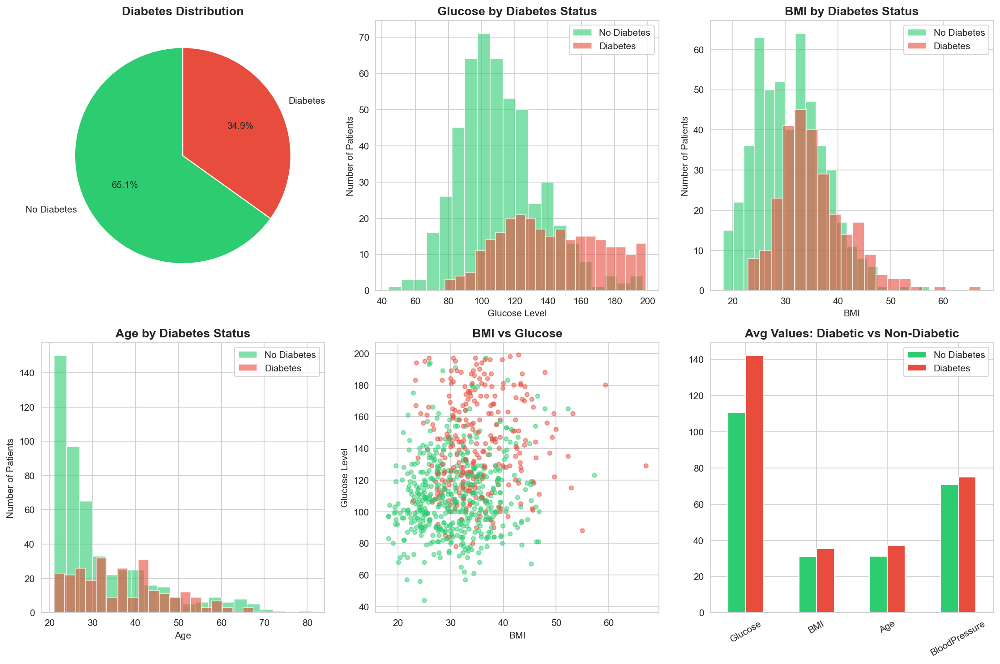
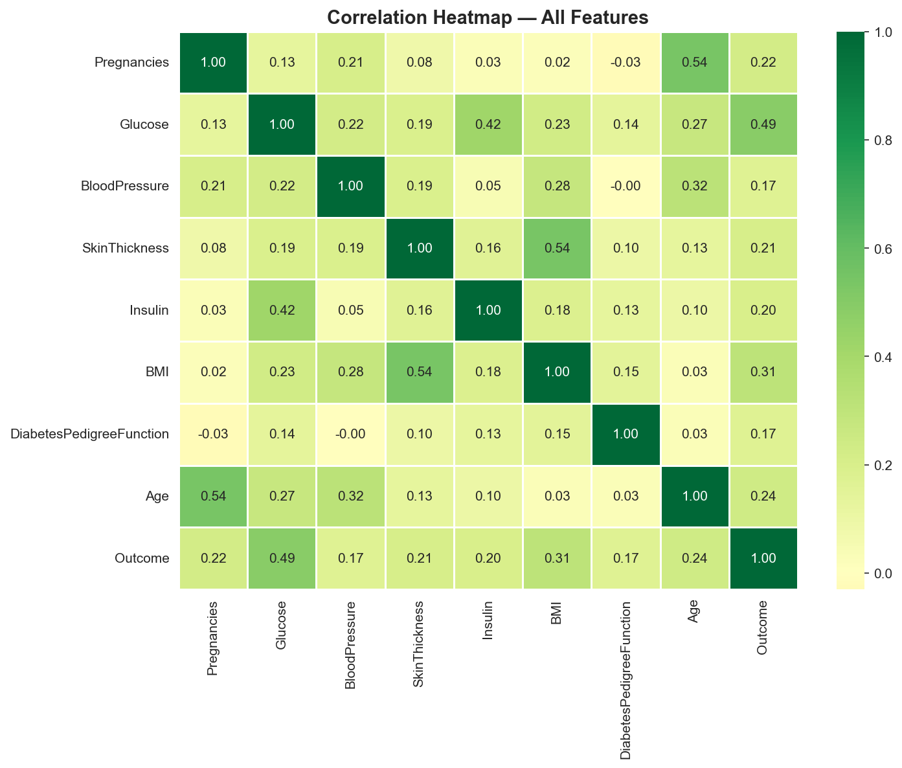

# 🏥 Diabetes Risk Analysis
### Healthcare Data Analysis Project

Analysis of the Pima Indians Diabetes Dataset 
using Python, Pandas, and Matplotlib.

---

## 📊 Project Overview
- **Dataset:** 768 patients, 9 clinical features
- **Goal:** Identify key risk factors for diabetes
- **Tools:** Python, Pandas, NumPy, Matplotlib, Seaborn

---

## 🔍 Key Findings
| Risk Factor | Non-Diabetic | Diabetic | Difference |
|---|---|---|---|
| Glucose | 110.7 | 142.1 | +28.4% 🔺 |
| BMI | 30.9 | 35.4 | +14.6% 🔺 |
| Age | 31.2 | 37.1 | +18.8% 🔺 |
| Insulin | 127.8 | 164.7 | +28.9% 🔺 |
| Blood Pressure | 70.9 | 75.1 | +5.9% 🔺 |

---

## 📈 Visualizations



---

## 🚨 Data Quality Issues Found
- Insulin: 48.7% missing values (recorded as 0)
- SkinThickness: 29.6% missing values
- BloodPressure: 4.6% missing values
- Fixed by replacing zeros with median values

---

## 💡 Clinical Conclusion
**High Glucose + High BMI + Older Age =
Highest risk combination for diabetes**

- Glucose is the strongest predictor (r=0.49)
- 192 patients had dangerous glucose levels (>140)
- 34.9% of this high-risk population had diabetes

---

## 🛠️ How to Run
```bash
pip3 install pandas numpy matplotlib seaborn
python3 diabetes_analysis.py
```

---

## 👨‍⚕️ Author
Medical Student & Healthcare Data Analyst in Training  
Analyzing medical data to improve patient outcomes
